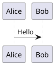

## Editor

Doorstop will open files using the editor specified by the `$EDITOR` environment variable. If that is unset, it will attempt to open files in the default editor for each file type.

## Git

**Linux / macOS**

No additional configuration should be necessary.

**Windows**

Windows deals with line-endings differently to most systems, favoring `CRLF` (`\r\n`) over the more traditional `LF` (`\n`).
The `YAML` files saved and revision-controlled by Doorstop have `LF`
line-endings, which can cause the following warnings:

```
(doorstop) C:\temp\doorstop>doorstop reorder --auto TS
building tree...
reordering document TS...
warning: LF will be replaced by CRLF in tests/sys/TS003.yml.
The file will have its original line endings in your working directory.
warning: LF will be replaced by CRLF in tests/sys/TS001.yml.
The file will have its original line endings in your working directory.
warning: LF will be replaced by CRLF in tests/sys/TS002.yml.
The file will have its original line endings in your working directory.
warning: LF will be replaced by CRLF in tests/sys/TS004.yml.
The file will have its original line endings in your working directory.
reordered document: TS
```

These warnings come from Git as a sub-process of the main Doorstop processes,
so the solution is to add the following to your `.gitattributes` file:

```
*.yml text eol=lf
```

From [Git's documentation](https://git-scm.com/docs/gitattributes):

> This setting forces Git to normalize line endings [for \*.yml files] to LF on checkin and prevents conversion to CRLF when the file is checked out.

## Optional Dependencies

Doorstop has minimal core dependencies, but certain features require additional tools to be installed on your system.

### LaTeX Publishing

To publish documents in LaTeX/PDF format, you need a LaTeX distribution installed:

#### Windows

Download and install [MiKTeX](https://miktex.org/download):

```powershell
winget install MiKTeX.MiKTeX
```

#### Linux (Debian/Ubuntu)

```sh
sudo apt-get update
sudo apt-get install texlive-latex-base texlive-latex-extra
```

#### macOS

```sh
brew install --cask mactex
```

#### Verification

After installation, verify that `pdflatex` is available:

```sh
pdflatex --version
```

### PlantUML Diagrams in LaTeX

If your documents contain PlantUML diagrams (using ` ​```plantuml` code blocks) and you want to publish them to LaTeX/PDF, you need three additional tools:

1. **Java Runtime Environment** (to run PlantUML)
2. **PlantUML** (to generate diagrams)
3. **Inkscape** (to convert SVG diagrams to PDF)

#### Windows Installation

```powershell
# Install Java Runtime (required for PlantUML)
winget install EclipseAdoptium.Temurin.17.JRE

# Install PlantUML
winget install PlantUML.PlantUML

# Install Inkscape (for SVG to PDF conversion)
winget install Inkscape.Inkscape
```

!!! warning "Add Inkscape to PATH"
    After installing Inkscape on Windows, you **must** add it to your PATH.

#### Linux Installation (Debian/Ubuntu)

```sh
sudo apt-get update
sudo apt-get install default-jre plantuml inkscape
```

#### macOS Installation

```sh
brew install openjdk plantuml inkscape
```

### Verification

Verify all dependencies are installed correctly:

```sh
java -version
plantuml -version
inkscape --version
```

!!! info "Inkscape Version Compatibility"
    Doorstop requires **Inkscape 1.0 or later**. Older versions used different command-line syntax that is not compatible.

### Troubleshooting
#### Windows: "inkscape: command not found"

**Cause:** Inkscape is not in your PATH.

**Solution:**

1. Verify Inkscape is installed: Check if `C:\Program Files\Inkscape\bin\inkscape.exe` exists
2. Add to PATH as described above
3. **Restart your terminal** - existing terminals won't see the PATH changes
4. Test: `inkscape --version`

#### LaTeX: "PlantUML diagram not found"

**Cause:** PlantUML diagrams require the `title` attribute.

**Solution:** Ensure all PlantUML code blocks have a title:

````markdown

````

Without the `title` attribute, Doorstop cannot determine the filename for the generated diagram.

#### Security Note: Shell Escape

!!! warning "Shell Escape Security"
    LaTeX publishing with PlantUML requires `pdflatex` to be run with the `-shell-escape` flag, which allows LaTeX to execute external commands (like `plantuml` and `inkscape`).
    
    The generated `compile.sh` script automatically uses this flag. Be aware of the [security implications](https://tex.stackexchange.com/questions/88740/what-does-shell-escape-do) when compiling LaTeX files from untrusted sources.

### Summary Table

| Feature                  | Required Tools                       |
| ------------------------ | ------------------------------------ |
| **LaTeX/PDF Publishing** | LaTeX distribution (MiKTeX/TeX Live) |
| **PlantUML in LaTeX**    | LaTeX + Java + PlantUML + Inkscape   |
| **HTML Publishing**      | *(no additional tools required)*     |
| **Markdown Publishing**  | *(no additional tools required)*     |
