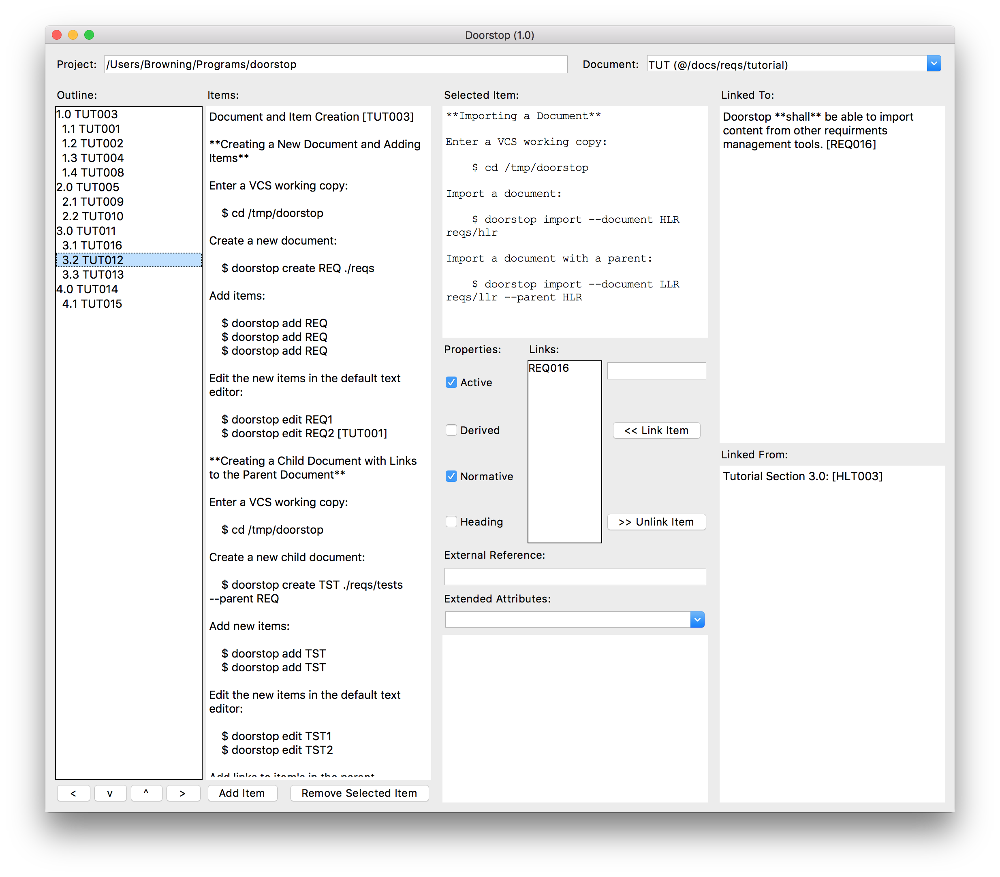

# Coming Soon

An **experimental** desktop graphical interface (GUI) is available as a way to perform basic editing tasks.

To launch the program:

```sh
$ doorstop-gui
```

A window similar to the following should appear:



If you're interested in helping finish this UI, please check out the [relevant open issues](https://github.com/jacebrowning/doorstop/issues?utf8=%E2%9C%93&q=is%3Aissue+is%3Aopen+gui) on GitHub.
